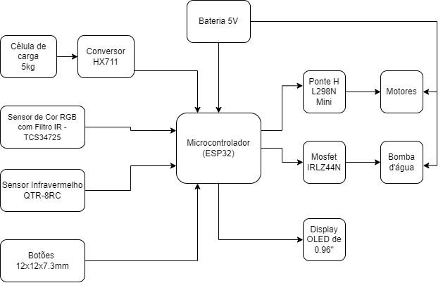

# Kirby

**Kirby** é o projeto semestral da disciplina **Microcontroladores e Sistemas Embarcados** (EEN251) do **Instituto Mauá de Tecnologia** (IMT), ministrada pelos professores [Sergio Ribeiro Augusto](https://www.linkedin.com/in/sergio-ribeiro-augusto-258a9ba0/?originalSubdomain=br) e [Rodrigo França](https://www.linkedin.com/in/rodrigo-fran%C3%A7a-847872b1/). 

## Sumário

- [Requisitos](#requisitos)
- [Escopo](#escopo)
  - [Diagrama de blocos](#diagrama-de-blocos)
  - [Tecnologias](#tecnologias-e-conceitos)
  - [Materiais](#materiais)
  - [Modelagem mecânica](#modelagem-mecânica)
  - [Modelagem financeira](#modelamento-financeiro)
- [Funcionamento](#funcionamento)
  - [Máquina de estados](#máquina-de-estados)
    - [Estados](#estados)
- [Testes](#testes)
- [Autores](#autores)

# Requisitos

| id  | requisito                                                                   | tipo      |
| --- | --------------------------------------------------------------------------- | --------- |
| 1   | Utilizar sensores analógicos ou digitais                                    | Técnico   |
| 2   | Servir bebidas aos clientes                                                 | Funcional |
| 3   | Seguir um trajeto no chão                                                   | Funcional |
| 4   | Verificar o abastecimento dos tanques para evitar uso incorreto dos motores | Técnico   |
| 5   | Utilizar um microcontrolador                                                | Técnico   |
| 6   | Utilizar padrões de conexão (I2C, SPI) vistos em aula                       | Técnico   |
| 7   | Interagir com o usuário por meio de botões                                  | Técnico   |

# Escopo

O projeto consiste em um robô autônomo que deve **seguir uma linha no chão**, **mudando de estado conforme a leitura de cores do sensor** e **interagindo com o usuário através de botões**. O robô deve ser capaz de carregar dois tipos de líquidos em seus tanques e servir o usuário conforme a interação.

## Diagrama de blocos

  

## Tecnologias e conceitos

- I2C (Comunicação com os displays e sensores)
- Transistores (MOSFET/Ponte H)
- PWM (Controle do motor)
- Autômatos (Lógica de funcionamento)
- PIO (Entrada e saída do microcontrolador)
- ESP-WROOM-32 (Microcontrolador)

## Materiais

O robô é montado a partir dos seguintes materiais:

- 1 microcontrolador **ESP32**
- 2 células de Carga de 5kg
- 2 conversores **HX711**
- 2 MOSFETs **IRLZ44N**
- 1 sensor de cor **TCS34725**
- 2 sensores de linha **QTR-8RC**
- 1 chassi de acrílico
- 1 ponte H L298N Mini
- 2 motores **3-6 V**
- 2 mini bombas
- 2 displays **OLED** I2C
- 3 botões
- Filamento ABS

## Modelagem mecânica

O projeto, requere certo nível de resistência térmica por parte do material diretamente em contato com a bebida (gelada ou quente), o que nos direcionou para o uso do material ABS, que tem essa propriedade.
Os containeres da bebida ficaram apartados da estrutura para evitar contato com componentes eletrônicos. O circuito elétrico fica próximo dos motores, diminuindo a necessidade de cabeamento extenso. Como o enfoque do projeto não era mecânico, a base para locomoção foi comprada pronta, maximizando o uso do tempo que seria gasto com o modelamento de motores, engrenagens para redução e preocupações com transmissão. Toda a estrutura foi baseada no personagem da Cultura Geek "Kirby", protagonista de uma franquia da Nintendo.

  

## Modelamento financeiro

Os componentes do projeto foram financiados inteiramente pelos integrantes do grupo, utilizando-se de materiais previamente obtidos e contribuição para manufatura da placa eletrônica impressa pelo Instituto Mauá de Tecnologia. Para fins de teste, os equipamentos do Instituto Mauá de Tecnologia como multímetro, fonte e protoboard foram utilizados. 
| Item | Preço Unitário (R$) | Quantidade | Preço Total (R$) |
|------------------------------------------------------|---------------------|------------|------------------|
| Sensor de Cor RGB com Filtro IR - TCS34725 | 28,40 | 1 | 28,40 |
| Célula de Carga 5Kg - Sensor de Peso | 17,90 | 2 | 35,80 |
| Chave DIP Switch 1 Via | 2,50 | 1 | 2,50 |
| Push Button (Chave Táctil) 12x12x7.3mm | 0,90 | 4 | 3,60 |
| Mini Bomba Submersível p/ Água | 12,90 | 2 | 25,80 |
| Módulo Conversor 24bit Hx711 p/ Célula De Carga | 8,90 | 2 | 17,80 |
| Sensor de Obstáculos Reflexivo Infravermelho | 7,90 | 2 | 15,80 |
| Display OLED 128x64 0.96" I2C - Pinos Soldados | 34,90 | 2 | 69,80 |
| Kit Chassi 2WD Robô para Arduino (Modelo 2) | 79,90 | 1 | 79,90 |
| Mini Ponte H Dupla L298N | 7,90 | 1 | 7,90 |
| Capa Redonda para Push Button 12x12x7.3mm (Preto) | 0,50 | 4 | 2,00 |

# Funcionamento

O funcionamento do robô é baseado em uma **máquina de estados** que controla o comportamento do robô conforme a leitura do **sensor infravermelho** e do **sensor de cor**.

Primeiramente, o robô deve ser calibrado para que o sensor de cor consiga identificar a linha no chão. Após a calibração, o robô deve seguir a linha até encontrar a cor verde, onde ele deve parar e interagir com o usuário.

Com a interação do usuário a partir dos botões, o robô deve servir o usuário com o líquido correspondente ao botão selecionado (dois líquidos até o momento). Caso o tanque atinja um **nível crítico**, determinado através da diferença de peso do robo com o tanque cheio e vazio; o robô deve retornar ao ponto inicial (cor azul) e reiniciar o processo.

Os **displays OLED** são utilizados de forma estética para simular o olho do personagem "Kirby".

## Depuração

No projeto, a linguagem C/C++ foi utilizada para a aplicação tanto por sua eficiência nesse tipo de caso de uso, quanto pela riqueza de material existente sobre esse tipo de projeto.

A Arduino IDE e as seguintes bibliotecas foram utilizadas para depurar o código

- Wire.h
- Adafruit_TCS34725.h (Sensor de cor)
- HX711.h (Módulo conversor de peso)

## Máquina de estados

  

### Estados

- **I**: Estado inicial
- **A**: Estado andando/seguindo
- **P**: Estado parado
- **C**: Estado crítico

# Testes

## Dia 15/05/2024

- **Teste de calibração do sensor de cor**
  - O sensor de cor foi calibrado para identificar a cor verde
- **Teste de calibração do sensor infravermelho**
  - O sensor infravermelho foi calibrado para identificar a linha preta no chão e iniciar o estado de girar
- **Teste de botão**
  - O botão foi testado para identificar a interação do usuário
- **Teste de bomba**
  - A bomba foi testada para identificar a interação do robô com o usuário e bombeamento dos líquidos

https://github.com/enzosakamoto/kirby/assets/98707474/40ef3852-a57a-4a14-8359-391d45e8bc85

# Autores

- [Antonio Ferrite](https://github.com/tom-ferrite)
- [Enzo Sakamoto](https://github.com/enzosakamoto)
- [Flavio Murata](https://github.com/flaviomurata)
- [Maria Fernanda Pinho Garcia](https://github.com/mafepinho)
- [Pedro Matumoto](https://github.com/pedromatumoto)
